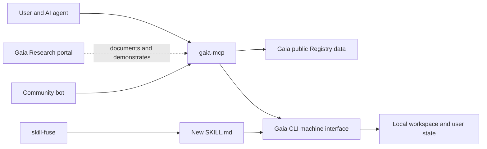

# Gaia MCP Architecture

Status: accepted target architecture, implementation pending  
Owner: Gaia Research  
Last updated: 2026-07-16

## 1. Decision

Gaia MCP is a standalone Gaia Research product in
`gaia-research/gaia-mcp`.

It does not live in the Gaia Skill Tree monorepo because it is a downstream
consumer of Registry truth and CLI actions. It does not live in the
`gaia-research/gaia-research` portal repository because local MCP transport,
package publishing, and protocol security have a different release cadence and
failure domain from the Next.js/Cloudflare website.

The governing product statement is:

> Gaia MCP helps an AI agent choose, trust, install, and progress agent skills
> using the evidence-backed Gaia Registry.

## 2. System context

The public Registry interface answers what exists and why it is trustworthy.
The local Gaia interface answers what is installed, what the workspace
demonstrates, and which validated actions are available.

## 3. Ownership seams

### Gaia Skill Tree owns

- canonical generic and Named Skill records;
- schemas, Trust Magnitude, evidence, prerequisites, and contributor identity;
- stable public data projections;
- workspace scanning and local capability state;
- installation, update, progression, and Intake implementations;
- validation, authorization, and audit trails for every mutation.

### Gaia MCP owns

- MCP transports and protocol compatibility;
- agent-oriented tool descriptions and structured result shapes;
- composition of public Registry facts with local workspace context;
- recommendation and comparison policy;
- approval choreography before state-changing actions;
- client compatibility, diagnostics, and installation guidance;
- release compatibility with Gaia public-data and CLI contracts.

### Gaia Research portal owns

- human-facing product explanation and installation instructions;
- interactive demonstrations and compatibility documentation;
- research into recommendation quality and tool improvements;
- website-level acceptance testing of the documented install path.

The portal may link to or launch Gaia MCP. It must not import the MCP server into
the Cloudflare website runtime.

## 4. Operating modes

### Registry mode

Registry mode requires only network access to Gaia's public data.

It supports search, inspection, comparison, and public trust explanations. It
does not infer local ownership or perform local actions.

### Bonded mode

Bonded mode is enabled when a compatible Gaia CLI machine interface is
available. It adds workspace analysis, local status, paths, installation,
updates, progression guidance, and Intake preparation.

The server must report its active mode and missing capabilities explicitly. It
must never silently substitute heuristic state for unavailable canonical state.

## 5. Deep module and adapters

The central module is the **Gaia agent interface**. Its small interface hides
Registry retrieval, local-context resolution, compatibility checks,
recommendation policy, approval requirements, and structured error handling.

Planned adapters:

- public-data HTTP adapter;
- local Gaia CLI adapter;
- in-memory adapters for contract and recommendation tests;
- stdio MCP adapter for local clients;
- Streamable HTTP MCP adapter only when hosted operation has a concrete use
  case and authentication model.

MCP handlers remain thin adapters. Domain behavior must not be implemented in
transport handlers.

## 6. Initial MCP interface

### `gaia_search`

Find generic and Named Skills by task, query, tier, stars, Trust Magnitude,
contributor, and installability.

### `gaia_inspect`

Return one evidence-backed dossier: description, relationships, Named
implementations, evidence, Trust Magnitude, source links, and freshness.

### `gaia_status`

Report mode, resolved identity, Registry freshness, compatible Gaia CLI
version, installed skills, and a concise user-state summary.

### `gaia_analyze_project`

Ask the canonical local Gaia implementation to analyze the workspace, then
explain detected capabilities, candidate matches, gaps, and confidence.

### `gaia_plan_path`

Explain the prerequisite path from current local capabilities to a target
skill, including satisfied and missing steps.

Results must include structured content. Markdown may be added as a convenience
view, but it is not the data contract.

## 7. Action policy

Actions are deferred until the read-only interface is stable.

When introduced:

- `gaia_install` previews before applying and requires approval;
- `gaia_update` reports planned changes before applying;
- `gaia_prepare_intake` may generate and validate Intake YAML without
  submitting it;
- `gaia_submit_intake` delegates to the canonical `gaia push --from-file`
  implementation and requires explicit approval.

Gaia MCP never writes Registry files, Skill Trees, proposal branches, or GitHub
issues directly. It never invokes maintainer-only `gaia dev` mutations.

## 8. Fusion semantics

Three operations remain distinct:

1. `skill-fuse` creatively combines installed skills into a new `SKILL.md`.
2. Gaia CLI progression records or unlocks a known Registry fusion.
3. Gaia Intake proposes a demonstrated skill or fusion for review.

Gaia MCP coordinates these tools and explains the lifecycle. It does not
collapse them into one ambiguous `fuse` tool.

## 9. Data contracts required from Gaia Skill Tree

Gaia MCP consumes versioned, machine-readable contracts rather than source
files:

- public search and detail projections for generic and Named Skills;
- graph relationships and prerequisite paths;
- evidence, Trust Magnitude, source, contributor, and freshness fields;
- `gaia scan --json` with a stable schema;
- machine-readable status and installed-skill output;
- dry-run/apply contracts for installation and updates;
- validated Intake preparation/submission contracts.

Until a required contract exists, the corresponding MCP capability remains
unavailable. The MCP implementation must not bypass the missing seam by reading
private repository layouts.

## 10. Identity and personal state

The location and authority of personal Skill Tree data is intentionally not
defined here. Gaia Skill Tree's extraction decision must define how the
canonical local interface resolves user state.

Gaia MCP consumes that resolved interface. It must not depend on a checked-out
`skill-trees/<user>/skill-tree.json` path.

## 11. Security and trust

- Public reads require no secrets.
- Tokens are never loaded from arbitrary MCP configuration files by discovery.
- State-changing tools are disabled unless the required canonical CLI contract
  and approval policy are present.
- Agent claims, connected tool names, and prose descriptions are signals, not
  verified evidence.
- Tool results identify their source, generation time, active mode, and
  compatibility versions.
- Input paths and identifiers are validated before reaching adapters.

## 12. Testing strategy

The Gaia agent interface is the test surface.

Required suites:

- contract fixtures for every supported Gaia public-data version;
- contract fixtures for every supported Gaia CLI machine version;
- recommendation tests through in-memory adapters;
- protocol tests for tool discovery, structured results, and errors;
- clean-install stdio tests against supported MCP clients;
- approval and fail-closed tests for every action tool;
- end-to-end website documentation test owned by `gaia-research/gaia-research`.

Fixture-only protocol tests are insufficient. Every release candidate must run
at least one real query against a current Gaia projection and one clean local
installation test.

## 13. Distribution

The intended package is `@gaia-research/mcp`, published independently from Gaia
Skill Tree and the Gaia Research portal.

The initial transport is stdio. A future hosted transport belongs in this
repository even if its deployment is operated through Gaia Research
infrastructure.

See [VERSIONING.md](VERSIONING.md) for compatibility and release rules.

## 14. Migration from existing implementations

There are currently two non-canonical implementations to retire:

- `gaia-skill-tree/packages/mcp`;
- the embedded Registry MCP server in `gaia-research/community-bot`.

Migration order:

1. establish the required public-data and CLI contracts;
2. ship read-only parity in this repository;
3. publish and test a clean install;
4. migrate `community-bot` to consume the canonical package;
5. update public documentation and website integration;
6. remove the old Skill Tree package, daemon, CLI shims, version lockstep, and
   stale documentation after parity is verified.

Repository extraction work remains owned by Gaia Skill Tree maintainers.
